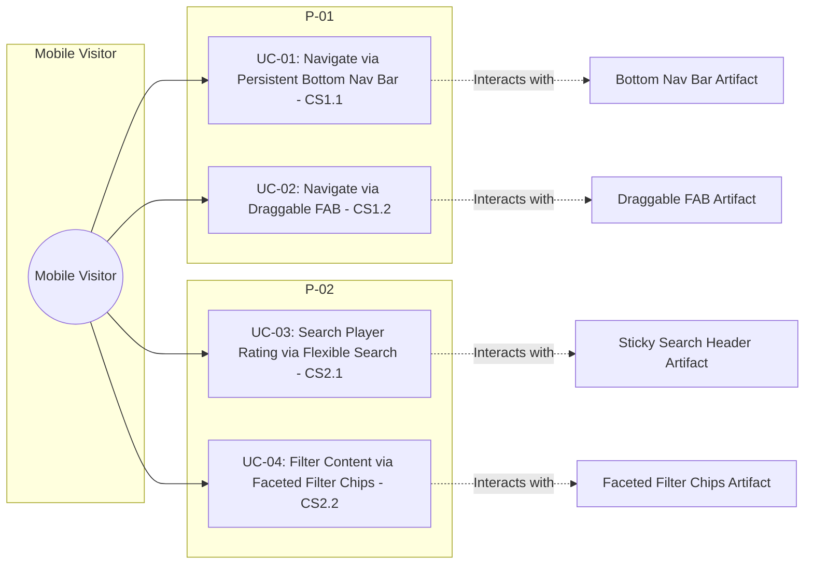
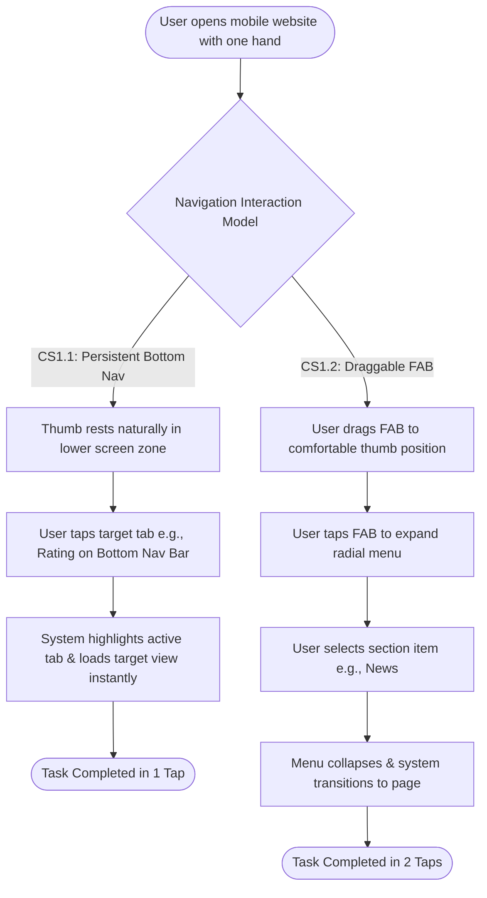
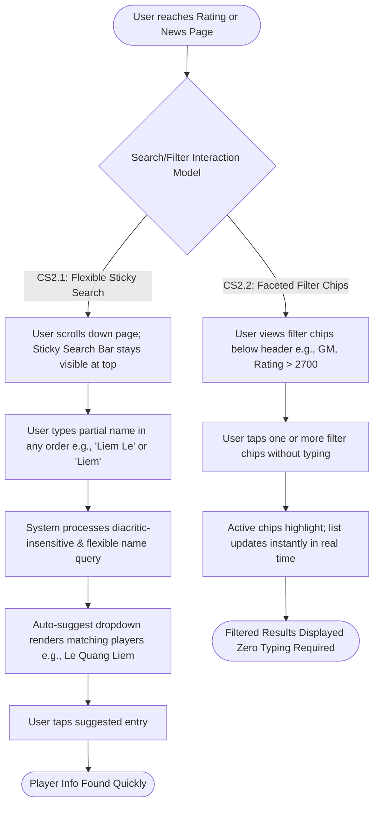

# PA2 Report - Requirement 4: Use Case Specification

**Group:** 06  
**Course:** CSC13112 - UI/UX Design  
**Assignment:** Project Assignment 2  
**Product Scope:** Freestyle Chess mobile website on smartphone browser  
**Document Purpose:** Provide Use Case Diagrams (Mermaid flow models) and complete Use Case Specifications for each conceptual solution proposed in `06-PA2-ProjectProposal.md`.

---

## 1. Overview & Conceptual Solution Mapping

In `06-PA2-ProjectProposal.md`, Group 06 proposed four conceptual solutions across two high-priority user problems (**P-01: One-Handed Reachability** and **P-02: Lack of Sticky Search & Filtering**).

This document formalizes the actors, artifacts, interaction flows, and detailed use case specifications for each proposed solution.

### 1.1 Summary of Proposed Conceptual Solutions

| Problem ID | Problem Description | Solution ID | Conceptual Solution Name | Target User Goal |
|---|---|---|---|---|
| **P-01** | Hamburger menu at top-left is out of reach for one-handed users | **CS1.1** | Persistent Bottom Navigation Bar | Direct 1-tap navigation to major sections within natural thumb sweep zone |
| **P-01** | Hamburger menu at top-left is out of reach for one-handed users | **CS1.2** | Draggable Floating Action Button (FAB) | Customizable, floating trigger that can be placed anywhere on screen |
| **P-02** | Lack of sticky search & filtering on long listing pages | **CS2.1** | Sticky Search Bar with Flexible Name Matching | Always-accessible text search accepting diacritics, partial names, and any word order |
| **P-02** | Lack of sticky search & filtering on long listing pages | **CS2.2** | Faceted Filter Chips (Tap-to-Filter) | Instant, zero-typing filtering by title (GM, IM), rating range, or event date |

---

## 2. Actors and Artifacts Inventory

### 2.1 Actors

* **Mobile Visitor (Primary Actor):** General smartphone user browsing the Freestyle Chess mobile website in short sessions (2-3 minutes) while commuting, resting, or multi-tasking.
* **First-Time / Casual User:** Visitor unfamiliar with Freestyle Chess who needs quick orientation and simple, low-effort navigation.
* **Core Chess Follower:** Experienced chess enthusiast seeking fast access to specific player ratings, rankings, and match developments.

### 2.2 System & Interface Artifacts

* **Bottom Navigation Bar Artifact (`ART-BNB`):** Persistent 5-tab bar (Home, News, Schedule, Rating, Videos) fixed at the bottom viewport boundary ($y = \text{bottom}$).
* **Draggable FAB Artifact (`ART-FAB`):** Circular action button floating over page content, supporting press-and-drag gestures to re-anchor to bottom-right, bottom-left, or custom positions.
* **Sticky Search Header Artifact (`ART-SSH`):** Fixed header component at top viewport ($y = 0$) containing a text input field, clear button, and real-time auto-suggest dropdown.
* **Faceted Filter Chips Artifact (`ART-FFC`):** Horizontal scrollable row of interactive chip toggles (e.g., `GM`, `IM`, `Rating > 2700`, `Geller Cup 2026`) that apply instant client/server data filters.
* **Data Listing View Artifact (`ART-DLV`):** Dynamic list container (Rating Leaderboard or News Feed) that renders filtered results with skeleton loading indicators.

---

## 3. Use Case Diagrams & Flow Models

Below are the Mermaid Use Case diagrams and Interaction Flow models for each proposed conceptual solution.

### 3.1 Use Case Diagram — Overall System Context

---

### 3.2 Flow Model — Conceptual Solution CS1.1 vs CS1.2 (Navigation)

---

### 3.3 Flow Model — Conceptual Solution CS2.1 vs CS2.2 (Search & Filtering)

---

## 4. Use Case Specifications

### 4.1 UC-01: Navigate via Persistent Bottom Navigation Bar (CS1.1)

| Field | Details |
|---|---|
| **Use Case ID** | **UC-01** |
| **Use Case Name** | Navigate to Main Sections via Persistent Bottom Navigation Bar |
| **Related Concept** | **CS1.1** (Persistent Bottom Navigation Bar for P-01) |
| **Primary Actor** | Mobile Visitor (One-handed smartphone user) |
| **Target Artifacts** | Bottom Navigation Bar Artifact (`ART-BNB`), Main View Container (`ART-DLV`) |
| **Preconditions** | User is browsing any page of the Freestyle Chess mobile website on a smartphone browser. |
| **Trigger** | User wants to switch from the current page to another primary section (e.g., from Home to Rating). |
| **Main Success Scenario** | **1. User Action:** User looks at the lower portion of the screen where `ART-BNB` is fixed. **2. System Response:** `ART-BNB` displays 5 distinct icons with text labels (*Home*, *News*, *Schedule*, *Rating*, *Videos*) within natural thumb reach. **3. User Action:** User taps the "Rating" icon using their holding thumb without shifting grip. **4. System Response:** System provides instant visual active state feedback (icon highlight), triggers a page loading indicator, and renders the Rating Leaderboard view. **5. User Action:** User begins scanning the Rating page content. |
| **Alternative Flows** | **ALT-1 (Repeated tap on active tab):** If user taps the icon of the page they are currently on, system smooth-scrolls the view back to the top of the page. |
| **Exception Flows** | **EX-1 (Network latency):** If page content fails to load within 2 seconds, system displays a skeleton loader inside `ART-DLV` and a "Retry" prompt while keeping `ART-BNB` active. |
| **Postconditions** | User successfully arrives at the selected section with zero grip adjustments. |
| **Empirical Evidence** | Validates **N03**; resolves reachability complaint from 43.1% of survey users (Q13) and direct interview struggles from P01, P02, P03. |

---

### 4.2 UC-02: Access Navigation Menu via Draggable Floating Action Button (CS1.2)

| Field | Details |
|---|---|
| **Use Case ID** | **UC-02** |
| **Use Case Name** | Access Navigation Menu via Draggable Floating Action Button (FAB) |
| **Related Concept** | **CS1.2** (Draggable FAB for P-01) |
| **Primary Actor** | Mobile Visitor (Left-handed, right-handed, or situational grip user) |
| **Target Artifacts** | Draggable FAB Artifact (`ART-FAB`), Floating Navigation Drawer (`ART-FND`) |
| **Preconditions** | User is on the mobile website; `ART-FAB` is visible near the bottom-right corner. |
| **Trigger** | User wants to access navigation while holding the phone in a non-standard or left-handed grip. |
| **Main Success Scenario** | **1. User Action:** User presses and holds `ART-FAB`, then drags it to a comfortable thumb position (e.g., bottom-left corner). **2. System Response:** System highlights `ART-FAB` with drop-shadow feedback and smoothly repositions the button following touch coordinates. **3. User Action:** User releases touch; system snaps `ART-FAB` to the nearest edge and saves position to local storage. **4. User Action:** User taps `ART-FAB`. **5. System Response:** `ART-FAB` transforms into `ART-FND` (radial menu or bottom sheet) displaying section shortcuts. **6. User Action:** User taps "Schedule". **7. System Response:** System navigates to Schedule view and collapses `ART-FND` back into `ART-FAB`. |
| **Alternative Flows** | **ALT-1 (Reset FAB Position):** User double-taps `ART-FAB` to reset its anchor back to the default bottom-right position. |
| **Exception Flows** | **EX-1 (Accidental Drag):** If drag distance is under 5px, system treats touch as a tap and opens `ART-FND`. |
| **Postconditions** | Navigation trigger is custom-anchored to the user's exact physical thumb reach. |
| **Empirical Evidence** | Validates **N04**; directly answers P05's request for a customizable draggable control and supports 41.7% of users with situational grips (Q4). |

---

### 4.3 UC-03: Search Player Rating via Flexible Sticky Search Bar (CS2.1)

| Field | Details |
|---|---|
| **Use Case ID** | **UC-03** |
| **Use Case Name** | Search Player Rating with Flexible Name Order & Auto-Suggestions |
| **Related Concept** | **CS2.1** (Sticky Search Bar with Flexible Name Matching for P-02) |
| **Primary Actor** | Chess Follower / Mobile Visitor |
| **Target Artifacts** | Sticky Search Header Artifact (`ART-SSH`), Data Listing View Artifact (`ART-DLV`) |
| **Preconditions** | User is on the Rating Leaderboard page containing over 100 player entries. |
| **Trigger** | User wants to find rating information for a specific player (e.g., "Le Quang Liem") without scrolling. |
| **Main Success Scenario** | **1. User Action:** User scrolls down the leaderboard; `ART-SSH` remains fixed at the top viewport ($y=0$). **2. User Action:** User taps the search text field in `ART-SSH`. **3. System Response:** Virtual keyboard appears; `ART-SSH` maintains top position. **4. User Action:** User types partial name in natural order (e.g., "Liem Le" or "liem"). **5. System Response:** System executes diacritic-insensitive, multi-word token query across database fields (FirstName, LastName, FullName). **6. System Response:** `ART-SSH` renders auto-suggest list showing matching player cards (e.g., "GM Le Quang Liem - Rating 2736"). **7. User Action:** User taps the suggested player card. **8. System Response:** System highlights the selected player row and scrolls smoothly to target entry. |
| **Alternative Flows** | **ALT-1 (No exact match):** If query yields no matches (e.g., "Liemmm"), system displays "No player found" with suggestions ("Did you mean: Liem Le?"). **ALT-2 (Clear search):** User taps "X" clear button in `ART-SSH` to restore full leaderboard. |
| **Exception Flows** | **EX-1 (Offline / Connection drop):** System relies on cached client-side index to serve auto-suggestions without freezing UI. |
| **Postconditions** | User locates target player rating within 3-5 seconds without excessive vertical scrolling. |
| **Empirical Evidence** | Validates **N11**, **N23**; directly fixes failed searches observed in P06 and P09, and supports 61.1% of users struggling with exact memory recall (Q19). |

---

### 4.4 UC-04: Filter Content via Faceted Filter Chips (CS2.2)

| Field | Details |
|---|---|
| **Use Case ID** | **UC-04** |
| **Use Case Name** | Filter Content via Faceted Filter Chips (Zero-Typing Mode) |
| **Related Concept** | **CS2.2** (Faceted Filter Chips for P-02) |
| **Primary Actor** | First-Time Visitor / Event-Driven Viewer |
| **Target Artifacts** | Faceted Filter Chips Artifact (`ART-FFC`), Data Listing View Artifact (`ART-DLV`) |
| **Preconditions** | User is browsing the Rating Leaderboard or Tournament News Feed. |
| **Trigger** | User wants to view specific subsets of information (e.g., Grandmasters only, or Geller Cup news) without typing. |
| **Main Success Scenario** | **1. User Action:** User views horizontal row of `ART-FFC` positioned directly below page title. **2. System Response:** `ART-FFC` presents clear category chips (`All`, `GM`, `IM`, `Rating > 2700`, `2026 Events`). **3. User Action:** User taps the "GM" (Grandmaster) chip. **4. System Response:** System toggles chip visual state to Active (filled background), filters list data instantly, and updates `ART-DLV`. **5. User Action:** User taps a secondary filter chip ("Rating > 2700"). **6. System Response:** System applies combined filter query (`Title == GM AND Rating > 2700`) and displays refined list of 12 top players. **7. User Action:** User reviews filtered results. |
| **Alternative Flows** | **ALT-1 (Deselect filter):** User taps active "GM" chip again to deselect it; system updates view to show all titles. |
| **Exception Flows** | **EX-1 (Empty result set):** If active chip combination returns 0 items, system displays clear empty state ("No players match these filters") with a 1-tap "Reset Filters" button. |
| **Postconditions** | User discovers specific target information through simple single-tap interactions without needing keyboard entry. |
| **Empirical Evidence** | Validates **N12**, **N27**; directly answers Q17 preference (chosen by 31 users / 81.9% wanting search/filter support) and resolves P10's inability to search by title or rating range. |

---

## 5. Summary & Verification Matrix

The four Use Case Specifications above cover 100% of the conceptual solutions proposed in `06-PA2-ProjectProposal.md`. 

| Use Case ID | Conceptual Solution | Problem Addressed | User Interaction Type | Verification Method |
|---|---|---|---|---|
| **UC-01** | CS1.1: Persistent Bottom Nav | P-01: Reachability | 1-tap direct navigation | Task completion time < 2s; zero thumb stretch |
| **UC-02** | CS1.2: Draggable FAB | P-01: Reachability | Touch-drag & 2-tap radial menu | Custom position persistence across sessions |
| **UC-03** | CS2.1: Flexible Sticky Search | P-02: Long List Search | Text input + auto-suggest | Success rate on reversed name order queries |
| **UC-04** | CS2.2: Faceted Filter Chips | P-02: Long List Search | 1-tap filter toggles | Zero-typing filtering by title and event date |
