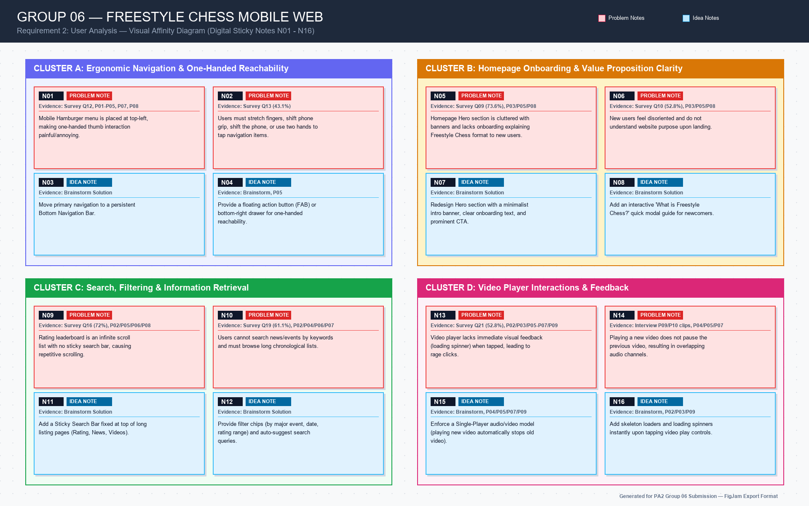

# PA2 Report - Requirement 2: User Analysis

**Group:** 06  
**Course:** CSC13112 - UI/UX Design  
**Assignment:** Project Assignment 2  
**Product Scope:** Freestyle Chess mobile website on smartphone browser  
**Document Purpose:** User problem identification, idea generation, affinity diagramming, and problem prioritization  

---

## 1. Overview & Brainstorming Setup

### 1.1 Objectives
The goal of this phase is to analyze the empirical evidence collected from Requirement 1 (72 survey responses and 13 direct interview sessions), brainstorm to identify core user problems, generate potential solution ideas, organize them using an **Affinity Diagram**, and prioritize the most severe problems to solve in the subsequent design proposal.

### 1.2 Brainstorming Session Record

| Field | Details |
|---|---|
| **Date & Time** | July 23, 2026 |
| **Participants** | Group 06 Members (Lê Mai Hoài Bảo, Trương Công Thiên Phú, Lâm Hữu Khánh, Phạm Chí Bảo Ninh, Phùng Ngọc Tuấn) |
| **Tool Used** | Digital Sticky Notes via Figma / FigJam |
| **Input Evidence** | `06-PA2-UserResearch.md`, `Khảo sát trải nghiệm người dùng trên Freestyle Chess mobile web (Responses) - Form Responses 1.csv`, Interview clip recordings |
| **Deliverable Output** | Affinity Diagram & Prioritized Problem Matrix |

---

## 2. Affinity Diagram

### 2.1 Visual Affinity Board (Digital Sticky Notes)

Below is the structured Affinity Board generated during the group brainstorming session, grouping user observations, pain points, and potential solution ideas into logical clusters.

> *Note: Embed or link your Miro/Figma/FigJam canvas export image below.*

  
*(Link to interactive FigJam/Figma board: [FigJam Affinity Diagram Canvas](#))*

---

### 2.2 Raw Sticky Notes Inventory

**Notes:** Data in the "Source / Evidence" column supports the "Stick Note Content", exceptions are listed below the table.

| Note ID | Category | Source / Evidence | Sticky Note Content |
| --- | --- | --- | --- |
| **N01** | Problem  | Survey Q12, P01/P02/P03/P04/P05/P07/P08      | Mobile Hamburger menu is placed at top-left, making one-handed thumb interaction painful/annoying.|
| **N02** | Problem  | Survey Q13 (43.1%), P02/P03/P04/P05/P07/P08  | Users must stretch fingers, shift phone grip, shift the phone, or use two hands to tap navigation items.|
| **N03** | Idea     | Brainstorm                                   | Move primary navigation to a persistent Bottom Navigation Bar.|
| **N04** | Idea     | Brainstorm, P05                              | Provide a floating action button (FAB) or bottom-right drawer for one-handed reachability.|
| **N05** | Problem  | Survey Q09 (73.6%), P03/P05/P08              | Homepage Hero section is cluttered with banners and lacks onboarding explaining Freestyle Chess format to new users. |
| **N06** | Problem  | Survey Q10 (52.8%), P03/P05/P08              | New users feel disoriented and do not understand website purpose upon landing.|
| **N07** | Idea     | Brainstorm                                   | Redesign Hero section with a minimalist intro banner, clear onboarding text, and prominent CTA.|
| **N08** | Idea     | Brainstorm                                   | Add an interactive "What is Freestyle Chess?" quick modal guide for newcomers.|
| **N09** | Problem  | Survey Q16 (72%), P02/P05/P06/P08            | Rating leaderboard is an infinite scroll list with no sticky search bar, causing repetitive scrolling.|
| **N10** | Problem  | Survey Q19 (61.1%), P02/P04/P06/P07          | Users cannot search news/events by keywords and must browse long chronological lists.|
| **N11** | Idea     | Brainstorm                                   | Add a Sticky Search Bar fixed at top of long listing pages (Rating, News, Videos).|
| **N12** | Idea     | Brainstorm                                   | Provide filter chips (by major event, date, rating range) and auto-suggest search queries.|
| **N13** | Problem  | Survey Q21 (52.8%), P02/P03/P05/P06/P07/P09  | Video player lacks immediate visual feedback (loading spinner) when tapped, leading to rage clicks.|
| **N14** | Problem  | Interview P09/P10 clips; P04/P05/P07         | Playing a new video does not pause the previous video, resulting in overlapping audio channels.|
| **N15** | Idea     | Brainstorm; P04/P05/P07/P09              | Enforce a Single-Player audio/video model (playing new video automatically stops old video).|
| **N16** | Idea     | Brainstorm; P02/P03/P09                      | Add skeleton loaders and loading spinners instantly upon tapping video play controls.|

**Exceptions**:
  - P08 Neutral about N10.
  - P08 supports N15 but neutral about N14.
  - P06 doesn't think N14 is a problem, and actually like it that way.

**Additional Problem Outside the Survey**:

**Notes:** These are problems that arose from direct Interviews rather than from questionairs, worth considering.

| Note ID | Category | Source / Evidence | Sticky Note Content|
| --- | --- | --- | --- |
| **N17**  | Problem  | P01 | Confirmation dialogs are too small, forcing users to scroll inside the dialog to read the full message before making a decision.|
| **N18**  | Problem  | P01 | Page transitions provide no loading indicator, making users unsure whether the site is loading or frozen and encouraging repeated taps.|
| **N19**  | Problem  | P02 | Video & Streams carousel looks swipeable because thumbnails are cut off, but horizontal swiping does not work and users must use Prev/Next buttons instead. |
| **N20**  | Problem  | P02 | Schedule navigation uses a down-arrow icon suggesting expansion, but the content slides in from the side, causing confusion.|
| **N21**  | Problem  | P02 | Schedule has two different exit controls ("X" and "Back to Main Menu"), making it unclear which one to use.|
| **N22**  | Problem  | P05 | Rating list rows have overly similar typography/visual structure, making it easy to overlook the desired player while scanning.|
| **N23**  | Problem  | P06/P09 | Rating search requires the player's name in a specific format/order, causing searches to fail when users enter a natural first-name/last-name order.|
| **N24**  | Problem  | P09 | Schedule does not provide enough information about upcoming matches or tournament brackets, forcing users to look elsewhere for this information.|
| **N25**  | Problem  | P09 | Video carousel stops responding to swipe gestures once a video is playing, forcing users to use Prev/Next controls instead.|
| **N26**  | Problem  | P10 | Hero video "Stop" button does not actually stop the video OR restart the video from the beginning instead of correctly pausing/stopping it. Button state does not match the video's actual state |
| **N27**  | Problem  | P10 | Ranking search cannot search by chess title or rating, despite users naturally wanting to find players using those attributes.|
| **N28**  | Problem  | P10 | Schedule banners appear interactive/tappable but do nothing when tapped.|
| **N29**  | Problem  | P10 | Schedule menu has a broken scroll boundary that prevents users from fully viewing some of its content.|

---

### 2.3 Affinity Cluster Descriptions

#### Cluster A: Ergonomic Navigation & One-Handed Reachability
* **Core Problem:** The current hamburger menu icon is positioned at the top-left corner. On modern smartphone screens, this forces right-handed users (44.4% one-handed users) to stretch their thumb unnaturally or change their grip, increasing device drop risk.
* **Generated Ideas:**
  * Implement a mobile **Bottom Navigation Bar** with key tabs (Home, News, Schedule, Rating, Videos).
  * Place a floating drawer or menu button at the bottom-right corner.

#### Cluster B: Homepage Onboarding & Value Proposition Clarity
* **Core Problem:** 52.8% of surveyed users had never heard of Freestyle Chess. The current homepage Hero section is overloaded with event banners without explaining the unique rules/format of Freestyle Chess, causing cognitive fatigue.
* **Generated Ideas:**
  * Simplify the Hero section hierarchy.
  * Add a prominent onboarding banner with a concise explanation ("Fischer Random / Chess 960 format") and a primary CTA ("Explore Events").

#### Cluster C: Search, Filtering & Information Retrieval
* **Core Problem:** 61.1% of users reported difficulty finding specific info when they don't remember exact names. Long rating lists require 20+ seconds of vertical scrolling without a sticky search bar or pagination.
* **Generated Ideas:**
  * Add a **Sticky Search Bar** that remains visible while scrolling.
  * Implement **Quick Filter Chips** (e.g., "Geller Cup", "Grandmaster Rating") and Auto-suggest queries.

#### Cluster D: Video Player Interactions & Feedback
* **Core Problem:** Tapping video thumbnails provides no loading indicator, causing users to think the site is frozen. Multiple videos can play simultaneously, causing overlapping audio streams.
* **Generated Ideas:**
  * Enforce **Single-Active-Player logic** (auto-pause active video when another starts).
  * Integrate skeleton loaders and instant visual press states.

---

## 3. Problem Prioritization Matrix

To scientifically select the most critical problems for the design proposal phase, each identified problem was evaluated on a scale from 1 to 5 using the following strict rubric:

### 3.1 Evaluation Rubric

* **Frequency:**
  * **1**: < 10% users experienced it.
  * **2**: 10% - 30% users experienced it.
  * **3**: 30% - 50% users experienced it.
  * **4**: 50% - 70% users experienced it (Very common).
  * **5**: > 70% users experienced it (Almost everyone).

* **Severity (Based on Nielsen's Severity):**
  * **1**: Cosmetic issue (Minor visual flaw, no real impact on task).
  * **2**: Minor usability problem (Slight annoyance but easily overcome).
  * **3**: Moderate problem (Causes hesitation or extra steps, but task is completed).
  * **4**: Major problem (Severe disruption, user gets frustrated or task takes significantly longer).
  * **5**: Usability catastrophe (Task blocked, user gives up or clicks away).

* **Evidence Strength:**
  * **1**: Assumption or gut feeling (No data).
  * **2**: Mentioned by only 1 interview participant, no survey data.
  * **3**: Backed by minor survey data OR 2-3 interview clips.
  * **4**: Backed by strong survey data AND clear interview observations.
  * **5**: Overwhelming proof (High survey % AND repeatedly observed failing in video clips).

* **Feasibility:**
  * **1**: Requires total system architecture rewrite (Very Hard).
  * **2**: Requires major backend/API logic changes.
  * **3**: Requires creating entirely new complex UI screens.
  * **4**: Requires moderate frontend adjustments (e.g., adding sticky CSS, new filters).
  * **5**: Quick fix (e.g., repositioning a button, changing text, fixing CSS limits - Very Easy).

$$ \text{Priority Score} = \text{Frequency} + \text{Severity} + \text{Evidence Strength} + \text{Feasibility} $$

| Problem ID | Problem Description | Frequency (1-5) | Severity (1-5) | Evidence Strength (1-5) | Feasibility (1-5) | Priority Score (4-20) | Decision |
|---|---|---:|---:|---:|---:|---:|---|
| **P-01** | One-handed reachability issues with top-left hamburger menu | 4 | 5 | 5 | 5 | **19** | **Selected (High)** |
| **P-02** | Lack of sticky search & filtering on long listing pages (Rating & News) | 5 | 4 | 5 | 4 | **18** | **Selected (High)** |
| **P-03** | Overlapping video audio streams & lack of loading feedback | 4 | 4 | 5 | 5 | **18** | **Selected (High)** |
| **P-04** | Overloaded Hero section & lack of onboarding for first-time users | 4 | 3 | 4 | 5 | **16** | **Selected (Medium)** |

### 3.1 Scoring Rationale & Justification

1. **P-01 (One-handed navigation reachability - Score 19/20)**:
   * *Frequency (4/5)*: 44.4% of surveyed users operate smartphones with one hand, and 43.1% reported physical effort/reachability issues.
   * *Severity (5/5)*: Crucial navigation failure; top-left menu placement forces grip shifts and thumb stretching, creating high device drop risks during mobile commuting.
   * *Evidence Strength (5/5)*: Validated by survey Q12/Q13 and direct video clip observations (P01, P02, P03).
   * *Feasibility (5/5)*: Highly feasible to solve by introducing a persistent mobile Bottom Navigation Bar or floating action drawer.

2. **P-02 (Lack of sticky search & filtering on long lists - Score 18/20)**:
   * *Frequency (5/5)*: 61.1% of users reported search difficulty when exact names are unknown; 81.9% requested search/filtering for long lists.
   * *Severity (4/5)*: Forces 20+ seconds of repetitive vertical scrolling, severely degrading short 2-3 minute browsing sessions.
   * *Evidence Strength (5/5)*: Validated by survey Q16/Q19/Q17 and interview clip observations (P01, P02, P04).
   * *Feasibility (4/5)*: Feasible via sticky position CSS, query filter chips, and auto-suggest input handling.

3. **P-03 (Video player feedback delay & audio overlap - Score 18/20)**:
   * *Frequency (4/5)*: 52.8% of users expected old videos to auto-stop; 44.4% were confused by unresponsive video tap states.
   * *Severity (4/5)*: Overlapping audio channels create extreme cognitive discomfort; missing loading spinners trigger repeated rage clicks.
   * *Evidence Strength (5/5)*: Validated by survey Q20/Q21/Q22 and interview clip observations (P02, P03, P09).
   * *Feasibility (5/5)*: Highly feasible via single-player event logic and skeleton loader components.

4. **P-04 (Overloaded Hero section & onboarding gap - Score 16/20)**:
   * *Frequency (4/5)*: 52.8% of surveyed participants were first-time users who had never heard of Freestyle Chess.
   * *Severity (3/5)*: Disorients newcomers upon landing, though experienced users can scroll past it.
   * *Evidence Strength (4/5)*: Validated by survey Q09/Q10 and interview clip observation (P03 L.T.K).
   * *Feasibility (5/5)*: Highly feasible by reorganizing content hierarchy and adding a concise intro banner.

---

## 4. Final Problem Statements

Based on the synthesis and prioritization matrix above, Group 06 selected the top severe problems to solve in the project proposal:

### Problem Statement 1 (Navigation & Reachability)
> **Mobile users need** an ergonomically reachable navigation system **because** placing critical navigation controls at the top-left corner causes thumb stretching, grip instability, and accidental taps, **especially when** operating the smartphone with one hand on the move.

### Problem Statement 2 (Information Retrieval & Search)
> **Mobile users need** a flexible search and filtering mechanism (sticky search bar and filter chips) **because** browsing long rating leaderboards and chronological news feeds requires excessive vertical scrolling and exact keyword memory, **especially during** quick 2-3 minute mobile browsing sessions.

### Problem Statement 3 (Media Interaction & Feedback)
> **Mobile users need** clear visual feedback during loading and controlled single-video playback **because** unresponsive tap states lead to rage clicks and simultaneous video playback produces confusing overlapping audio, **especially when** viewing match highlights or livestreams.

---

## 5. Conclusion & Transition to Project Proposal

The user analysis phase successfully consolidated the raw empirical data from Requirement 1 into four clear affinity clusters, prioritized the key problems using a structured score matrix, and formulated three final Problem Statements. 

These problem statements will serve as the direct foundation for generating conceptual design solutions in **Requirement 3 (Project Proposal)**.
